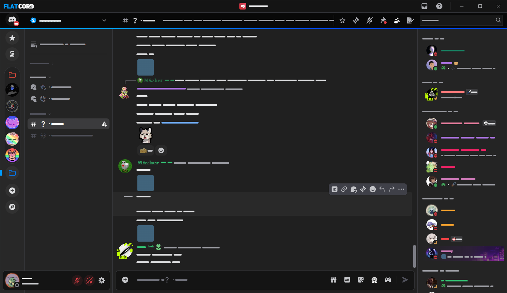

<h3 align="center">
 <br/>
 Skiny dla <a href="https://betterdiscord.app/">BetterDiscord</a> & <a href="https://vencord.dev/">Vencord</a> 
</h3>

## Screenshots

<details>
<summary>FlatCord</summary>

</details>
<details>
<summary>Windows 11 (forked from zuzumi, broken since new UI)</summary>

</details>

>[!WARNING]
>Skiny nie działają w trybie jasnym. Zalecane używanie ciemnego trybu Discorda.

> [!CAUTION]
> Skin Windows 11 jest zepsuty od momentu wgrania nowego GUI przez discorda. 

## Instalacja
#### BetterDiscord
1. Pobierz wybranego skina [FlatCord](https://github.com/Gomido/BetterDiscord/blob/master/themes/FlatCord/FlatCord.theme.css) lub [Windows 11](https://github.com/Gomido/BetterDiscord/blob/master/themes/Windows11Theme/Windows11.theme.css)
2. Wejdź w `Ustawienia` > `Themes` i na górze zakładki wybierz ikonę folderu
3. Wklej plik skina do folderu `Themes`

## Personalizacja skina
Wklejkasz zawartość którą chcesz zmodyfikować do zakładki custom css.
Tabela parametrów do edycji:

| Parametr                                               | Opis                                                                      | Wartość             | Domyślna wartość     |
| ------------------------------------------------------ | ------------------------------------------------------------------------- | --------------------| ---------------------|
| `--avatars`                                            | Promień zaokrąglenia awatarów, im wyższa tym większe zaokrąglenie         | od `0px` do `50px`  | `10px`               |
| `--accentcolor`                                        | Głowny kolor skina (akcent ramek, przycisków, paska tytułu, chatu)        | HEX                 | `#eca60f`            |
| `--accentcolor2`                                       | Drugi kolor skina (jedynie służy do nadania gradientu na pasku tytułu)    | HEX                 | `#eb7f04`            |
| `--accentcolor3`                                       | Trzeci kolor skina (paski przy nazwach osób po najechaniu)                | HEX                 | `#FFFFFF`            |
| `--mentionbackground`                                  | Tło wzmianek @ping                                                        | RBGA                | `0, 126, 255`        |
| `--titlebar`                                           | Kolor paska górnego z nazwą bieżącego kanału                              | HEX                 | `#141414`            |
| `--chatbackground`                                     | Kolor chatu                                                               | HEX                 | `#202020`            |
| `--channellistcolor`                                   | Kolor listy kanalow, uzytkownikow z prawej                                | HEX                 | `#242424`            |  
| `--guildlistcolor`                                     | Kolor paska z serwerami                                                   | HEX                 | `#282828`            |
| `--headercolor`                                        | Kolor nagłówka (nazwa serwera, przypięte, szukanie)                       | HEX                 | `#080808`            |
| `--input-color`                                        | Kolor wyskakujacych okienek i pol tekstowych                              | HEX                 | `#181818`            |
| `--button-color`                                       | Kolor przycisków                                                          | HEX                 | `#343434`            |
| `--border-color`                                       | Kolor ramek okien, przycisków                                             | HEX                 | `#393a3f`            |
| `--notification-width`                                 | Grubośc ramki nowych wiadomości - kółka                                   | px                  | `2px`                |
| `--spacing-width`                                      | wielkość ramki wokół okna aplikacji - 0 wyłącza                           | px                  | `2px`                |
| `--rs-width`                                           | Odstęp między awatarem a ramką statusu (chat, lista osób)                 | px                  | `2px`                |
| `--text-link`                                          | Kolor linków                                                              | HEX                 | `#var(--accentcolor)`|
| `--online`                                             | Kolor statusu online                                                      | HEX                 | `#28A745`            |
| `--idle`                                               | Kolor zaraz wracam                                                        | HEX                 | `#faa61a`            |
| `--dnd`                                                | Kolor nie przeszkadzać                                                    | HEX                 | `#DD2C2C`            |
| `--invisible`                                          | Kolor niewidoczny                                                         | HEX                 | `#747f8d`            |
| `--streaming`                                          | Kolor streaming                                                           | HEX                 | `#643da7`            |
| `--shadow`                                             | wielkość cieni pod oknam                                                  | HEX                 | `#141414`            |
| `--dm-columns`                                         | Liczba zakładek na liście znajomych (biblioteka, nitro, sklep, znajomi)   | Liczba              | `3`                  |

Przykładowy kod:
```css
:root {
  --avatars: 50px;
  --accentcolor: #eca60f;
  --accentcolor2: #eb7f04;
  --mentionbackground: 0, 126, 255;
}
```


### Credits
Zuzumi - [Windows11 Theme](https://github.com/zuzumi-f/Discord-11)
